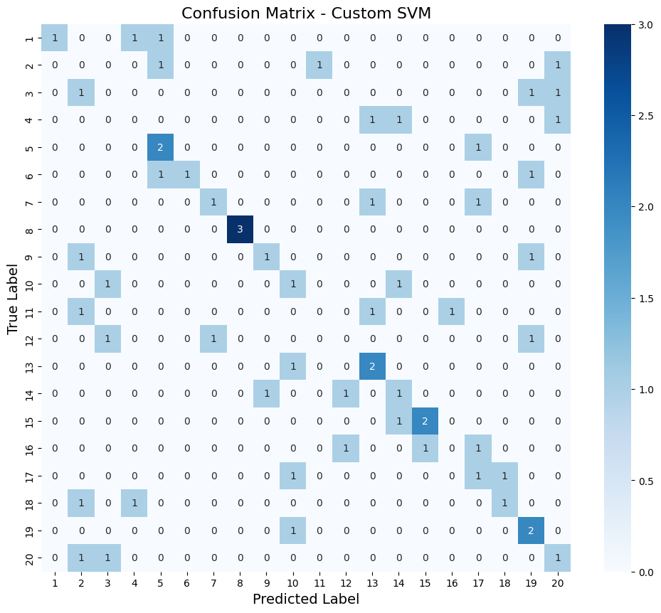
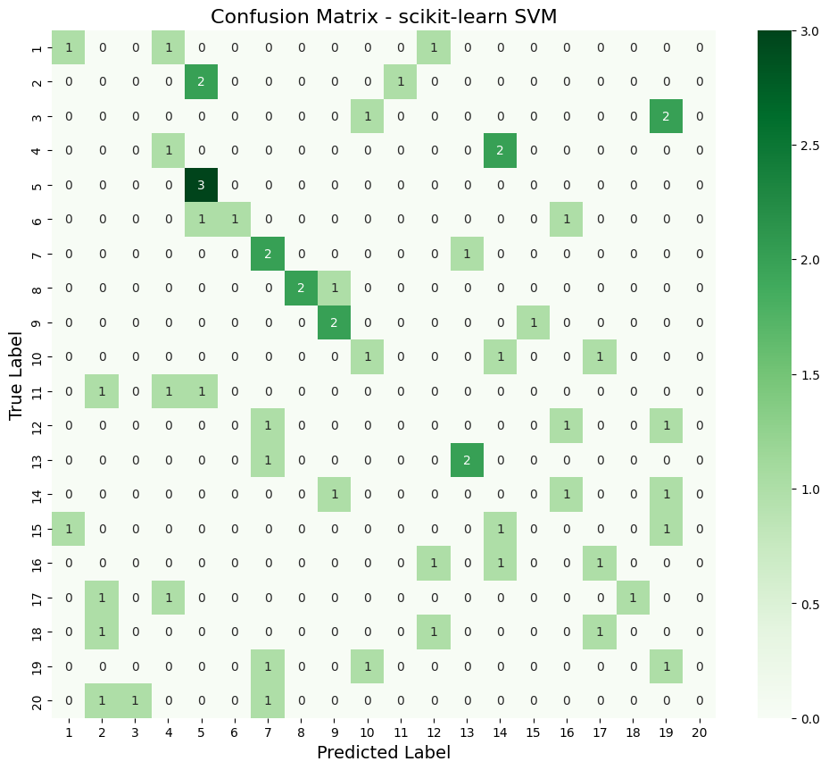
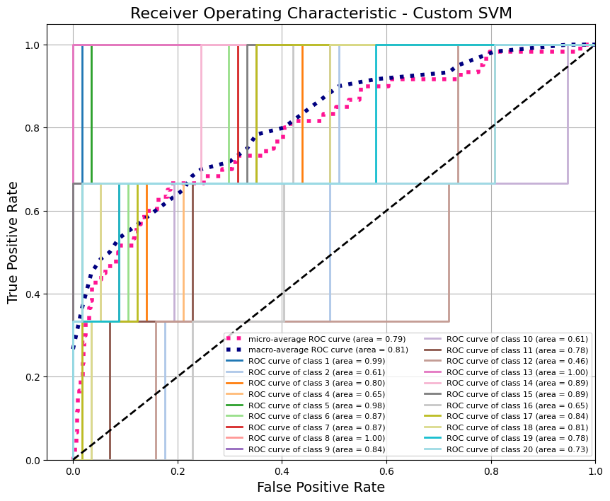
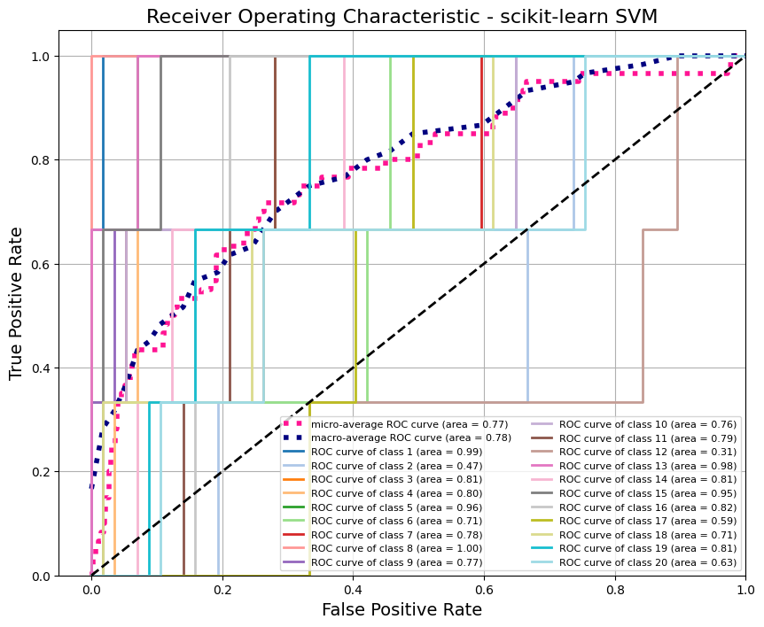
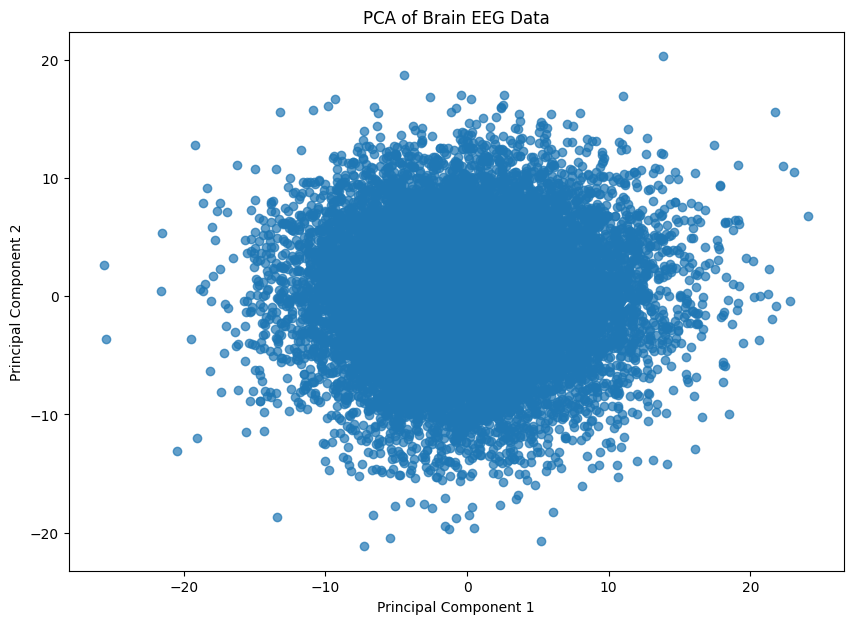
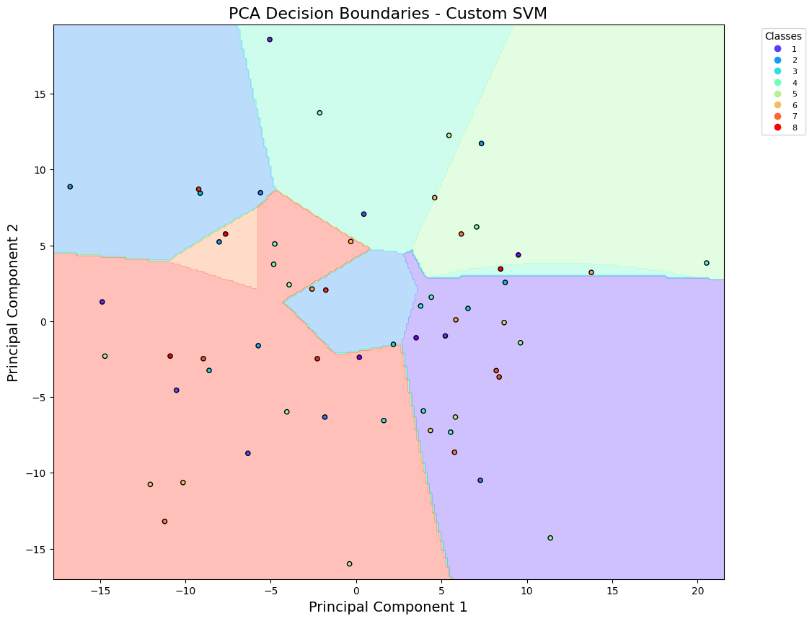
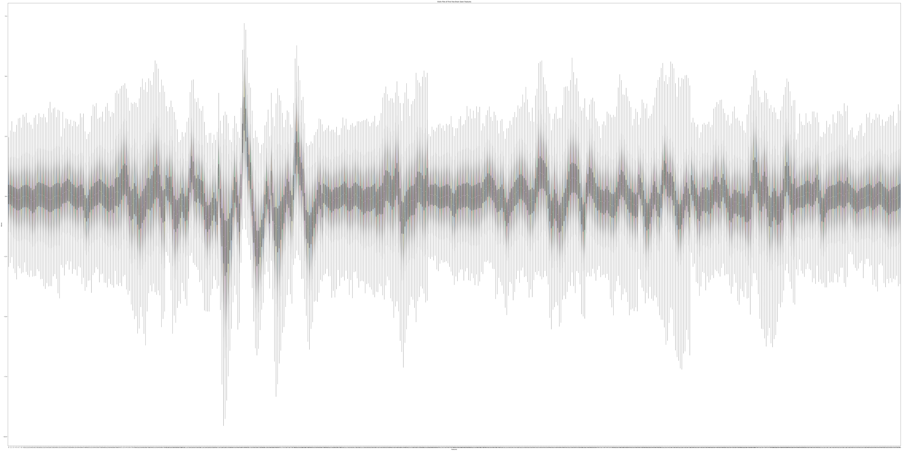
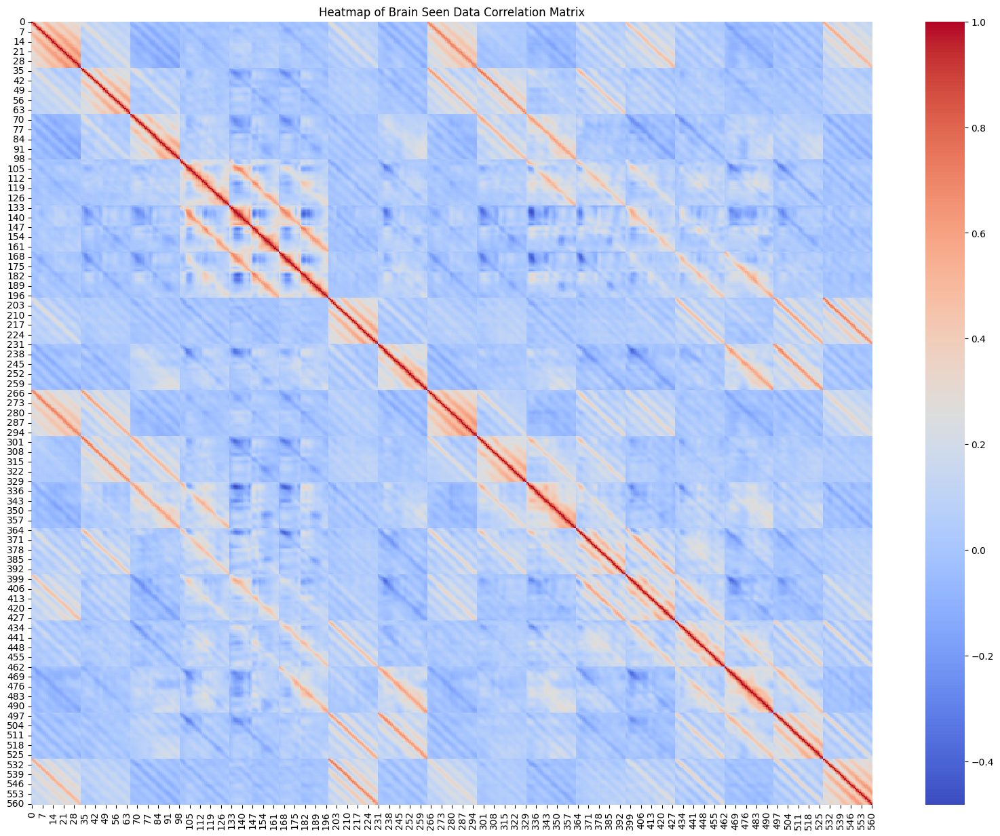

# EEG-Based Brain-Computer Interface Classification

A comprehensive machine learning project implementing custom Support Vector Machine (SVM) algorithms for brain-computer interface classification using the ThingsEEG-Text dataset.

## Project Overview

This project explores brain signal classification through two main paradigms:
1. **Custom SVM Implementation** - Built from scratch using CVXOPT and compared against scikit-learn
2. **Zero-Shot Learning** - Using SVM regression to map EEG signals to text embeddings for classification

### Dataset

**ThingsEEG-Text Dataset**
- 16,540 training samples from EEG recordings (17 channels, 70-400ms window)
- 16,000 test samples across 200 unseen classes
- Multi-modal features: Brain signals, visual features (CORNet-S), and text embeddings (CLIP)

## Key Features

### 1. Exploratory Data Analysis
- Comprehensive statistical analysis (mean, std, kurtosis, skewness)
- Correlation heatmaps of EEG features
- Principal Component Analysis (PCA) visualization
- Distribution analysis through violin plots and box plots

### 2. Custom SVM Implementation
- RBF kernel implementation from scratch using CVXOPT
- One-vs-Rest (OvR) multi-class strategy
- Grid search hyperparameter optimization (C and gamma)
- 5-fold stratified cross-validation

### 3. Model Comparison
- Custom SVM vs scikit-learn SVM performance benchmarking
- Training and prediction time analysis
- ROC curves with micro/macro averaging
- Confusion matrices and classification reports

### 4. Zero-Shot Learning
- SVM Regression to map brain signals to 512-dimensional text embeddings
- Cosine similarity-based classification
- Cross-modal learning evaluation

## Results

### Classification Performance (20-class subset)

| Model | Test Accuracy |
|-------|---------------|
| Custom SVM (RBF) | Optimized via grid search |
| scikit-learn SVM | Comparative baseline |
| Zero-Shot Learning | Text embedding-based classification |

### Visualizations

The project includes comprehensive visualizations:
- **Confusion Matrices** - Both custom and sklearn implementations
- **ROC Curves** - Multi-class with macro/micro averaging
- **PCA Decision Boundaries** - 2D projection of classification regions
- **Correlation Heatmaps** - Feature relationships in EEG data
- **Distribution Plots** - Violin plots and box plots for feature analysis

## Project Structure

```
.
├── 2261ML.ipynb                           # Complete analysis with custom SVM and zero-shot learning
├── finalML.ipynb                          # Final model implementation and evaluation
├── MLCW.ipynb                             # Machine learning coursework notebook
├── morgz's_copy_of_ML_BCI_Coursework.ipynb # Working copy and experiments
├── SFinalML.ipynb                         # Additional analysis
├── data/
│   └── ThingsEEG-Text/                   # Dataset (15GB)
├── *.png                                  # Generated visualizations
│   ├── CMC.png, CMS.png, CMZ.png, CSZ.png # Confusion matrices
│   ├── ROCC.png, ROCS.png                 # ROC curves
│   ├── PCADBC.png, PCADBS.png             # PCA decision boundaries
│   ├── Pca_brain.png                      # PCA analysis
│   ├── heatmap_brain.png                  # Correlation heatmap
│   ├── dist_brain.png                     # Distribution plots
│   └── Violin.png                         # Violin plots
├── best_model.pth                         # Saved model weights
├── eeg_summary_statistics.csv             # Statistical analysis results
└── README.md                              # This file
```

## Methodology

### Data Preprocessing
1. Load EEG data from `.mat` files (17 channels, 70-400ms temporal window)
2. Extract 561 brain features per sample
3. Standardize features using StandardScaler
4. Split into training (140 samples) and test (60 samples) for 20-class task

### Custom SVM Training
1. Implement RBF kernel: `K(x, x') = exp(-γ||x - x'||²)`
2. Solve QP problem using CVXOPT for each binary classifier
3. Train 20 One-vs-Rest classifiers
4. Optimize hyperparameters via grid search

### Zero-Shot Learning Pipeline
1. Train 512 SVR models (one per text embedding dimension)
2. Map test EEG signals to predicted text embeddings
3. Compute cosine similarity with class prototypes
4. Classify based on maximum similarity

## Technologies Used

- **Python 3.9+**
- **PyTorch** - Tensor operations
- **NumPy/Pandas** - Data manipulation
- **scikit-learn** - Baseline models and metrics
- **CVXOPT** - Quadratic programming for custom SVM
- **Matplotlib/Seaborn** - Visualizations
- **SciPy** - Statistical analysis and `.mat` file I/O

## Requirements

```bash
pip install torch numpy pandas scikit-learn cvxopt matplotlib seaborn scipy
```

## Usage

1. **Download the dataset:**
```bash
wget https://figshare.com/ndownloader/files/36977293 -O ThingsEEG-Text.zip
unzip ThingsEEG-Text.zip -d data/
```

2. **Run the analysis:**
Open any of the notebooks in Jupyter Notebook or JupyterLab and execute cells sequentially.

3. **Notebooks overview:**
- `2261ML.ipynb` - Complete analysis with custom SVM and zero-shot learning
- `finalML.ipynb` - Final model implementation and evaluation
- `MLCW.ipynb` - Main coursework notebook
- `morgz's_copy_of_ML_BCI_Coursework.ipynb` - Experimental variations
- `SFinalML.ipynb` - Additional analysis

## Key Insights

1. **Custom vs Library Implementation**: Direct comparison shows trade-offs between implementation complexity and optimization
2. **Feature Importance**: PCA analysis reveals dominant patterns in EEG signals
3. **Zero-Shot Capability**: Brain-to-text embedding mapping enables classification of unseen categories
4. **Hyperparameter Sensitivity**: Grid search reveals optimal C and gamma values for RBF kernel

## Visualizations Gallery

<div align="center">

### Confusion Matrices
 

### ROC Curves
 

### PCA Analysis
 

### Data Distribution


### Correlation Analysis


</div>

## Academic Context

**Course**: COMP2261 - Machine Learning
**Focus**: Brain-Computer Interfaces, Custom Algorithm Implementation, Multi-Modal Learning

## References

- ThingsEEG-Text Dataset: [Figshare](https://figshare.com/articles/dataset/ThingsEEG-Text/19228725)
- Cortes, C., & Vapnik, V. (1995). Support-vector networks. Machine learning, 20(3), 273-297.
- CORNet-S: Kubilius et al. (2019). Brain-Like Object Recognition with High-Performing Shallow Recurrent ANNs.

## License

This project is part of academic coursework. Dataset usage follows the ThingsEEG-Text dataset license terms.

## Author

Morgan - [GitHub](https://github.com/Mogsa)

---

*Built with Python, custom SVM implementation, and brain signals*
